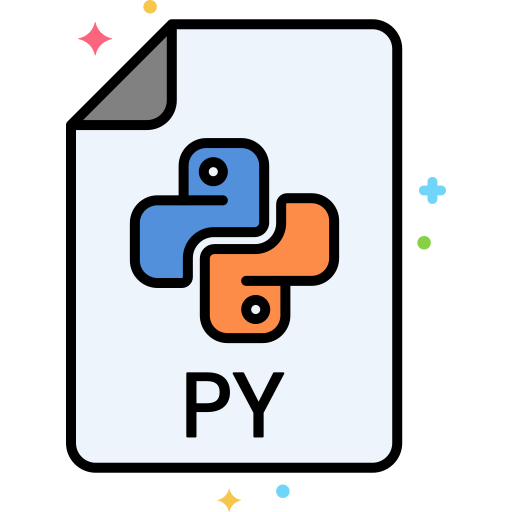

## Core Python Development Resources

A public repository to hold core python development resources for the curious and beginning core Python developer.

### Official Docs

* [Getting Started](https://devguide.python.org/setup/#setup)
* [Lifecycle of a Pull Request](https://devguide.python.org/pullrequest/)
* [Developer's Guide](https://devguide.python.org/#)

### Deep Dives

* Liou, Daw-Ran (2017) [Getting Started with Python Internals](https://medium.com/@dawranliou/getting-started-with-python-internals-a5474ccb8022)
* Shaw, Anthony (2019) [Your Guide to the CPython Source Code](https://realpython.com/cpython-source-code-guide/)
* Stinner, Victor (2017) [Python Development Documentation](https://pythondev.readthedocs.io/)
* [Inside the Python Virtual Machine](https://leanpub.com/insidethepythonvirtualmachine/read)
* Raghu, Prashanth [Internals of Python3.6](https://docs.google.com/document/d/1zrRTahXojd1gUGxK16Iwcqs0LUivqXK659hn4h9tOVw/edit#)
* [CPython Guide](https://paper.dropbox.com/doc/CPython-Guide-m7BQyPth6AIDUdZ6EmBNM)
* Van Rossum, Guido [Yet another guided tour of CPython](https://paper.dropbox.com/doc/Yet-another-guided-tour-of-CPython-XY7KgFGn88zMNivGJ4Jzv)
* Van Rossum, Guido [History of Python Blog](http://python-history.blogspot.com/)
* Wirtel, Stephane (2015) [Exploring Our Python Interpreter](https://speakerdeck.com/matrixise/exploring-our-python-interpreter?slide=26)
* Wirtel, Stephane (2018) [Python Loves Your Contributions](https://speakerdeck.com/matrixise/python-loves-your-contributions?slide=21)
* Guo, Philip (2014) [CPython internals: A ten-hour codewalk through the Python interpreter source code](http://www.pgbovine.net/cpython-internals.htm)
* Poulain, Laurent [Yet Another Python Internals Blog](https://pythoninternal.wordpress.com/)
* Golubin, Artem [Personal Blog](https://rushter.com/blog/)
* ZPpoint, [CPython-Internals](https://github.com/zpoint/CPython-Internals)
* VanTol, Alexander [Memory Management in Python](https://realpython.com/python-memory-management/)
* Golubin, Artem (2019) [Garbage Collection in Python: Things You Need To Know (Python 3.6)](https://rushter.com/blog/python-garbage-collector/)

### Other Pythonic Shenanigans

* Allison Kaptur, [A Python Interpreter Written in Python](http://aosabook.org/en/500L/a-python-interpreter-written-in-python.html)
* HowCode, [Make Your Own VM in Python (1)](https://youtu.be/5U__sbjazPc), [Make Your Own VM in Python (2)](https://youtu.be/C3RD_iwDPTE)
* CodePulse, [Make Your Own Language in Python](https://youtu.be/Eythq9848Fg)
* Beazley, David (2014) [Discovering Python](https://youtu.be/RZ4Sn-Y7AP8)
* Powell, James (2017) [So You Want To Be A Python Expert](https://youtu.be/RZ4Sn-Y7AP8)
* Powell, James (2017) [Advanced Metaphors in Coding with Python](https://youtu.be/R2ipPgrWypI)

### Disclaimer

This is a personal list of resources, compiled for educational purposes. If there are errors or issues with attribution, please submit a PR and I will glady correct/update the document.

### Attributions

Icon made by [Flat Icons](https://www.flaticon.com/free-icon/python_2721287) from [www.flaticon.com](https://www.flaticon.com/)
